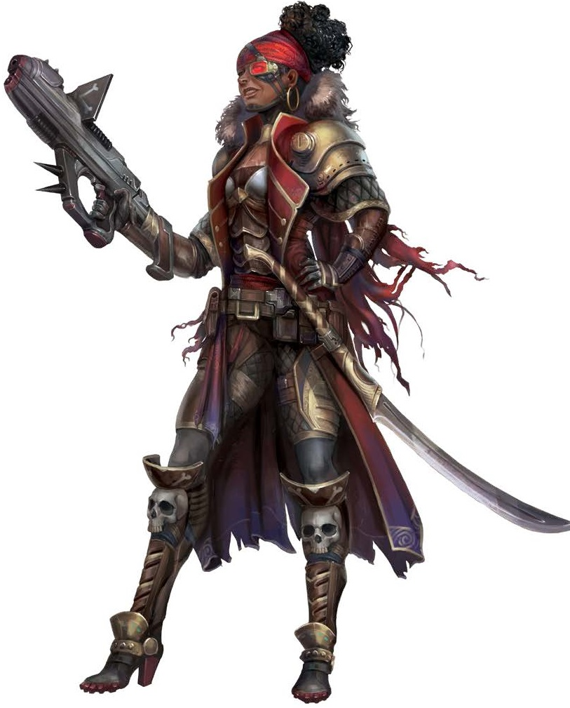
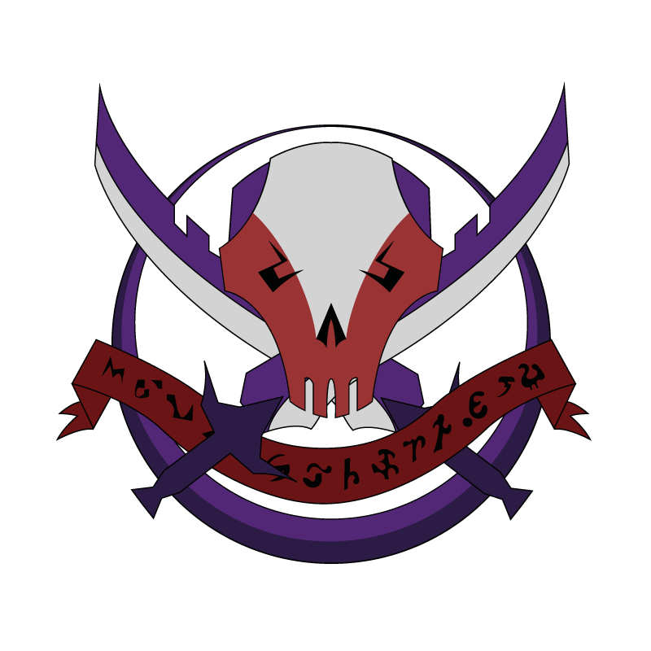

# Свободные Капитаны (Free Captains)

Межзвёздные авантюристы и независимые капитаны

### Общая характеристика

Свободные Капитаны - разношёрстное сообщество независимых космических капитанов, пиратов, торговцев, наёмников и беглецов, для которых свобода и личная воля ценнее любого закона.
Они отвергают власть крупных государств и мегакорпораций, предпочитая жить "по своим правилам", часто на грани закона или за её пределами.

Свободные Капитаны объединяются не столько ради идеалов, сколько ради выживания в галактике, где остаться свободным - подвиг. Их корабли и небольшие флотилии патрулируют окраины, скрываются в аномальных зонах и свободных системах, становятся центрами обмена нелегальными грузами, контрактами и слухами.

### Структура и устройство
Формально организации нет. Капитаны не подчиняются никому, но следуют негласному "Кодексу Просторов" - нельзя предавать своих, нельзя работать на Федерации или корпорации против капитанов, уважай данное слово.

В экстренных случаях наиболее уважаемые капитаны собирают неформальный "Совет Бурь" для решения судьбоносных вопросов (война, крупные сделки, объявление охоты). Также отдельные крупные объединения создаются временно для особо опасных или прибыльных операций.

### Образ жизни и культура
Свобода и независимость, вера в собственный выбор, культ личности капитана и уважение к авторитету, заработанному делом. 
Кража или предательство среди своих карается изгнанием, а иногда и смертью.

Среди Капитанов можно встретить представителей практически всех рас галактики, их корабли и станции полны уникальных традиций, обычаев и даже жаргона.

### Влияние и отношения
**Официальные власти:** Враги, разыскиваемые преступники, но на практике Федерация иногда нанимает Капитанов для грязной работы или закрывает глаза на отдельные их "услуги".

**Корпорации:** Некоторые используют Капитанов как посредников, наёмников и для нелегальных перевозок, но предают при любой возможности.

**Окраинные системы и подполье:** Часто считают Капитанов последней защитой от влияния корпораций и официальных властей. 
В бедных и свободных мирах капитаны - герои и легенды.

