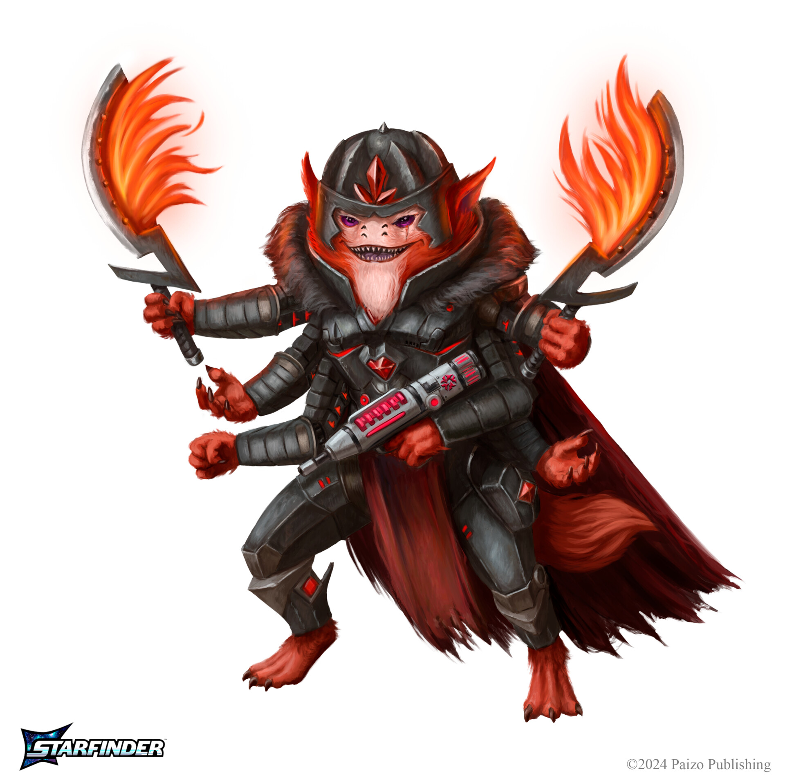

# Адские Рыцари (Hellknights)

Порядок через железо и страх

### Общая характеристика
Адские Рыцари - это военизированный орден, посвятивший себя поддержанию порядка, закона и контроля любой ценой. Их главная вера - хаос разрушителен, а настоящая справедливость достигается лишь через дисциплину, силу и подавление личных прихотей ради общего блага.
Они действуют в роли судей, палачей и карателей вне зависимости от государственной принадлежности, часто оставаясь вне официальной юрисдикции.

В глазах простых людей Адские Рыцари - жестокие фанатики, подавляющие любые проявления неповиновения, но для многих миров, страдающих от анархии, они единственная сила, способная навести хоть какой-то порядок.

### Структура и устройство
Орден разделён на множество отдельных ординов (приказов), каждый со своей интерпретацией "идеального порядка" и уникальным кодексом, но все они подчиняются общему принципу:
"Закон важнее милосердия. Страх - инструмент порядка. Наши цели - защита от хаоса."

Орденами руководят магистры и командоры. В каждом ордене строгая иерархия, железная дисциплина, постоянные тренировки.
Набор часто идёт из бывших военных, фанатиков справедливости, а иногда и из тех, кого сам мир отверг за жестокость.

### Образ жизни и культура
Железная дисциплина - ожидается абсолютное послушание приказам, любой проступок карается незамедлительно.

Каждый рыцарь носит характерную чёрную или тёмно-металлическую броню с пугающими символами, зачастую вдохновлённую демоническими или адскими образами, чтобы внушать страх врагам.

У Адских Рыцарей принят культ силы воли, они учат подавлять свои слабости и чувства, считая эмоции источником хаоса.

### Влияние и отношения
**Государства и корпорации:**
Часто ордену позволяют действовать как внештатным карателям для самых сложных или спорных миссий, когда официальные силы бессильны, запятнаны коррупцией или боятся замарать руки.
Но власти всегда с опаской относятся к Рыцарям, допуская их к делам, они рискуют потерять контроль.

**Население:**
В бедных районах страх и ненависть. В раздираемых хаосом системах - надежда на порядок любой ценой.

