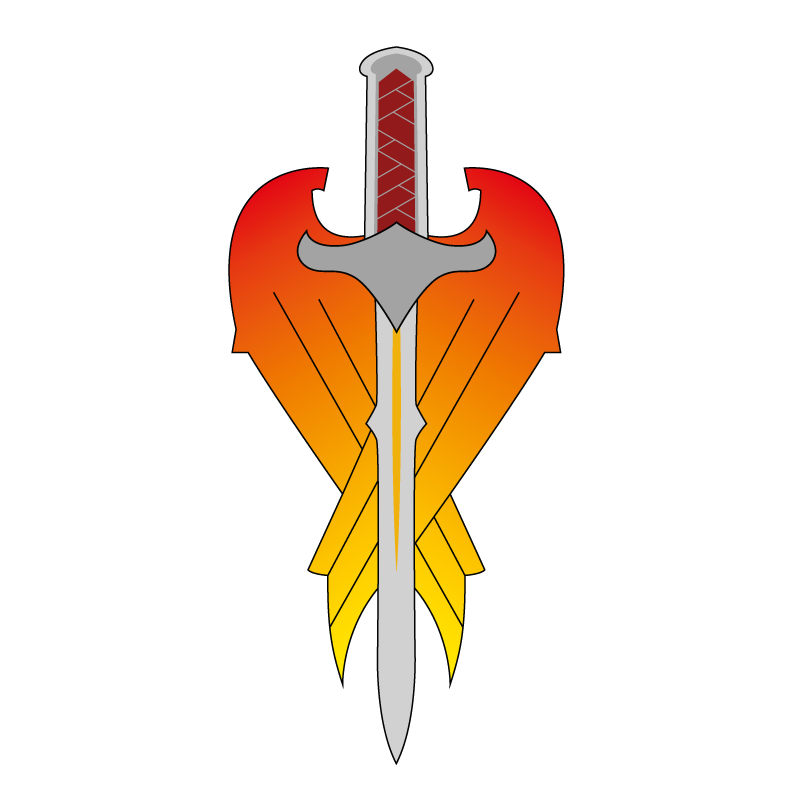

# Рыцари Иомедеи (Knights of Iomedae)

Справедливость, честь и свет

### Общая характеристика
Рыцари Иомедеи - это религиозный и рыцарский орден, посвятивший себя защите невинных, борьбе с тиранией и служению идеалам справедливости. Они действуют как паладины среди звёзд, несущие свет в самые тёмные уголки галактики и неся ответственность за свои поступки перед богиней Иомедеей, которую почитают как воплощение справедливости, отваги и чести.

Рыцари верят, что добро должно быть деятельным и сильным, а справедливость не абстрактным понятием, а живым выбором. Они готовы к жертве, но требуют отчётности и от союзников, и от себя самих.

Для одних герои, настоящие рыцари света. Для других фанатики, мешающие "прагматичному порядку".

### Структура и устройство
Орден организован иерархически, с чёткой системой званий - от младших оруженосцев до Владык-Мечей (высших командующих). Во главе каждого подразделения стоит Верховный Судья, отвечающий как за боевую, так и за духовную сторону ордена.

Все члены ордена дают клятву служения Иомедее и её ценностям: защите слабых, искоренению зла и честной жизни. Каждый рыцарь проходит испытания не только оружием, но и доблестью, состраданием и верностью принципам.

Некоторые флотилии действуют автономно в далёких системах, выступая как светочи надежды в глухих, забытых уголках галактики.

### Образ жизни и культура
Жизнь рыцаря Иомедеи - это сочетание воинской дисциплины, духовных практик и постоянной саморефлексии.

Они носят светлые доспехи с золотыми или серебряными элементами, часто с символами меча и солнечного света - символами богини. Молитвы, ритуалы покаяния и дневники помыслов - часть их повседневной жизни.

У рыцарей принято следить за моральной чистотой своих действий, стремиться к искуплению даже за непреднамеренное зло и защищать даже тех, кто их боится.

### Влияние и отношения

**Государства и корпорации:**
С опаской принимают помощь ордена: с одной стороны, Рыцари - сильные союзники в борьбе со злом и хаосом, с другой - неудобные, потому что могут начать расследовать преступления самих элит.
Корпорации особенно не любят орден за вмешательство во "внутренние дела".

**Население:**
Уважаемы и любимы в угнетённых регионах, где они реально спасают жизни и защищают колонии от насилия.
Однако из-за их идеализма и религиозности к ним иногда относятся с подозрением или считают отсталыми и наивными.

