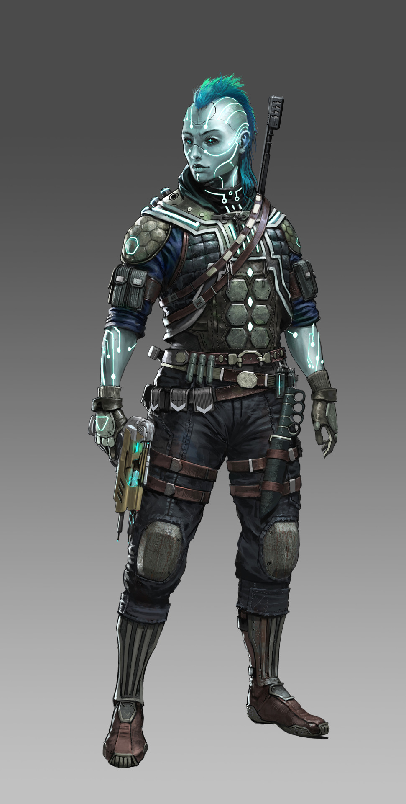

# Андроиды (Androids)
Изначально Андроиды появились как синтетические существа, созданные разными технологически развитыми цивилизациями прошлого. Какими именно - никто уже не помнит, и судьба этих цивилизаций давно затеряна во времени, но Андроиды сумели стать самостоятельной расой, пока в 2120 году их не покорила Космическая Федерация. Впоследствии Андроидов десятилетиями воспринимали как служебных роботов, но они добились официального признания разумным видом и гражданских прав. Тем не менее, многие люди до сих пор смотрят на них свысока - как на “продвинутые машины”, не способные на эмоции. Но, в отличие от большинства других конструктов, у Андроидов есть души.

!!! note "Ты скорее всего..."
    - Стараешься не дать использовать себя.
    - Ищешь свой смысл в галактике.
    - Оцениваешь других по тому как они относятся к простыми работниками, фанатам, питомцам.

!!! note "Другие возможно..."
    - С трудом считывают твои эмоции или не всегда понимают, когда ты их проявляешь.
    - Тайно завидуют твоему отсутствию старения
    - Могут испытывать вину из-за истории эксплуатации андроидов как дешёвой рабочей силы

Андроиды выживают практически в любых условиях, могут стать частью любой культуры и встречаются по всей галактике. Многие из них ищут свои истоки и задаются вопросами о собственной идентичности и устройстве мира. Андроиды очень разные — несмотря на промышленное происхождение, внешность у них уникальна.

### Физическое описание
Андроиды - биомеханические конструкты, обычно похожие на гуманоидов с заметной “техно-эстетикой”: неоновые контуры, светящиеся схемы, искусственные элементы. Рождаются в литейных цехах, бывших заводах мегакорпораций или исследовательских комплексах. Древние андроиды были почти полностью биологическими, современные - совмещают кибернетику, синтетику и нанотехнологии. Им нужны еда и сон, но они не стареют и не размножаются. Они имеют врожденного понятия пола, хотя многие выражают гуманоидные гендерные идентичности или плавно переключаются между ними. Обычно через 80–120 лет андроид “освобождает” тело для новой души в процессе называемом обновлением (Renewal).

### Общество
Андроиды, как правило, осторожны при посещении новых мест и знакомстве с новыми людьми. Как только они чувствуют себя комфортно, андроиды, как правило, формируют тесные узы дружбы и родства, создавая "найденные семьи", и принимая целые улицы и сообщества как свой дом, вместо того, чтобы оставаться ограниченными границами, образованными стенами. Андроиды часто стараются изо всех сил помогать друг другу, своим выбранным семьям и сообществам, и большинство из них не хотят прекращать жизнь другого андроида, зная, что это положит конец не одной жизни, а бесчисленным другим душам, которые однажды могут обитать в этом теле.

**Примеры имен**: Аша, Blue-17, Селита, Данив, Emene-3, Era-4, Флик, Гарро, Historia-6, Hope-1, Исеф, Мелоди, Нага, Олас, Омен, Прайм, Руби-17, 26, Урдун, Верити-3 и Хосе.

### Отношение к другим расами
**Об Людях:** "Завоеватели, угнетатели. Но в последнее время стало лучше. Они способны на великодушие и на жестокость, на дружбу и на подлость - зачастую одновременно. Среди них можно встретить союзников, но нельзя расслабляться, ведь для большинства ты всё ещё инструмент или проблема, а не личность. Но иногда люди проявляют искренность и способность к переменам - это даёт надежду."

**О Лашунта:** "Дипломатичны, вежливы, часто действительно стремятся понять. Интерес к нашей "душе" больше исследовательский, но иногда искренний. С ними легко обсуждать философию, но они редко идут дальше сочувствия."

**О Йсоках:** "Отличные напарники в технике и торговле. Их честность и простота располагают к доверию, хотя для них ты чаще всего просто особенный механизм. По-настоящему плохого отношения не ждёшь, но и близкие связи возникают редко"

**О Пахтра:** "Сочувствуют и принимают, помнят о свободе. Среди них легче быть собой, но они ждут искренности взамен."

**О Весках:** "Уважают силу, но в нас её не видят. Мы для них не противники и не братья по вере, а всего лишь "инструменты", пусть и эффективные. Контакт безопасен, пока не мешаешь их планам."

**О Ширренах:** "Видят в нас родственные души. Они тоже бывшие рабы, но уже нашедшие свой путь. Их коллективизм помогает почувствовать себя принятым, но иногда становятся слишком заботливыми, будто мы хрупкие."

**О Скиттермндерах:** "Хаос, помощь и радость в чистом виде. Если ты упал, они первые подхватят и принесут поесть, даже если ты об этом не просил. Их искренность - редкость в этой галактике."

