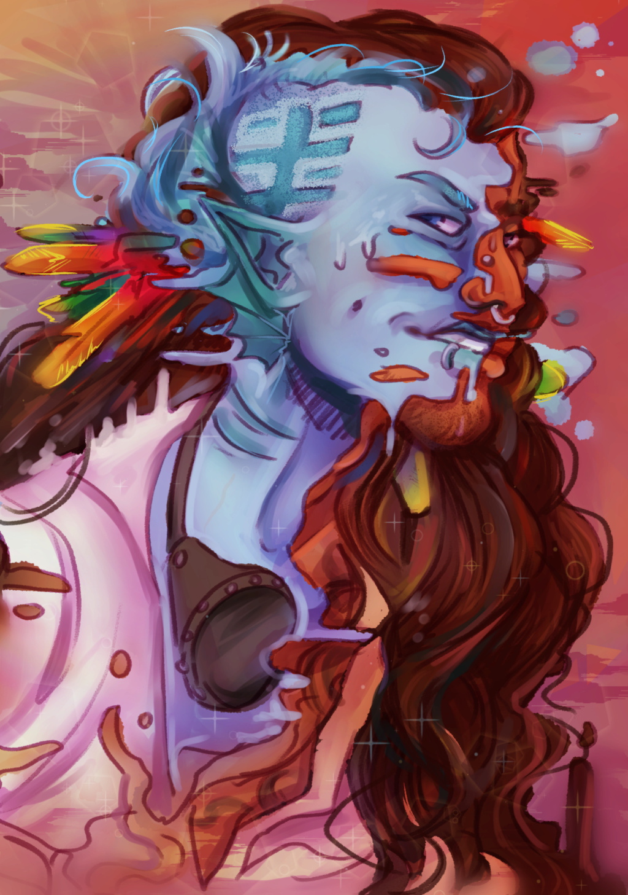

# Астразоаны (Astrazoans)

### Физическое описание
В истинной форме Астразоан похож на большую морскую звезду с пятью–семью конечностями, скрытыми органами и мешком в центре. Его кожа может менять цвет и текстуру, а все внутренние органы способны перестраиваться для новых форм. Большинство времени Астразоаны проводят в обличьях других рас, часто настолько искусно, что отличить их можно только при детальном медосмотре. Старшие Астразоаны зачастую имеют несколько личностей - по одной на каждую конечность, что делает их по-настоящему уникальными и многогранными существами.

!!! note "Возможно, вы..."
    - Легко принимаете новые формы и личности, подстраиваясь под окружение.
    - Находите радость в изучении чужих культур и традиций.
    - Показываете свою истинную форму только тем, кому полностью доверяете.
    - Чувствуете себя "своим" почти в любой компании, не теряя при этом уникальности.

!!! note "Вероятно, другие..."
    - Завидуют вашей способности к изменению внешности и манер.
    - Не всегда узнают вас — ни внешне, ни по имени.
    - Удивляются вашей эрудиции и врождённой дипломатичности.
    - Подозревают, что у вас всегда есть второй, третий и седьмой "я".

### Общество и культура
Астразоаны - редкий и таинственный вид, не имеющий родного мира или единой истории. Они селятся среди других рас, быстро принимая их привычки, язык, обычаи и даже способы мышления. Личное имя и облик часто меняются, а настоящее имя хранится в секрете. Несмотря на свою гибкость, большинство Астразоанов гордятся уникальностью и стараются беречь других представителей своего вида, оставаясь в тени и избегая раскрытия. Их дипломатичность и умение видеть ситуацию с разных точек зрения делают их отличными посредниками и разведчиками.

### Отношение к другим расам
**О Людях:**
"Вечно суетятся и часто доверяют первому впечатлению. Иногда легко стать для них своим, иногда совсем невозможно."

**О Лашунта:**
"Ценят дипломатию и рассудительность, но редко раскрывают истинные чувства. С ними легко вести игру в маски и, кажется, им это даже нравится."

**О Йсоках:**
"Любят новизну, ценят гибкость. С Йсоками приятно делиться историями, а иногда и личинами. Они редко судят по внешности, но всегда замечают детали."

**Об Андроидах:**
"Схожи с нами - вечные вопросы о своей природе, смена форм, поиск места в мире. Между нами легко возникает взаимное уважение, даже без слов."

**О Пахтра:**
"Ценят традиции и верность, не всегда понимают, зачем менять маски. Но их честность делает их надёжными, если заслужить доверие."

**О Весках:**
"Прямолинейны, видят мир в чёрно-белых тонах. Их тяжело обмануть, но легко вывести из себя. Лучше держаться на расстоянии или соблюдать их правила."

**О Ширренах:**
"Чувствуют коллектив, но принимают индивидуальность. Иногда даже слишком интересуются нашими личностями - приходится менять их чаще обычного."

**О Скиттермандерах:**
"Не задают лишних вопросов, легко принимают перемены и обожают всё необычное. С ними проще всего быть собой и кем угодно ещё."

### Имена
Астразоаны обычно имеют отдельные имена для каждой личности или формы, но хранят истинное имя в тайне. Настоящее имя часто состоит из трёх-четырёх слогов, например: Адрогалл, Азуша, Си, Сирибан, Фарахан, Лейлейка, Мийлин, Суникай, Ксенелей, Занилей.
Часть Астразоанов используют первый слог истинного имени как короткое прозвище для чужих.

