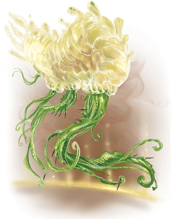

# Барату (Barathus)

### Физическое описание
Барату - парящие существа, похожие на ярких медуз или дирижабли, с множеством щупалец и постоянно меняющейся формой. Их тело может становиться больше или меньше, приобретать новые органы и даже сливаться с другими Барату, образуя коллективные формы. После слияния - конгломерата, они могут выглядеть как гигантские цветы, облака, кольца или нечто совершенно абстрактное. Цвет, размер и пропорции Барату зависят от окружающей среды и текущего этапа жизни.

!!! note "Возможно, вы..."
    - С энтузиазмом принимаете любые перемены — тела, среды, целей.
    - Часто меняете свою внешность или даже структуру, чтобы лучше соответствовать ситуации.
    - Любите коллективную работу и считаете одиночество странным или тревожным.
    - Не видите большой разницы между "я" и "мы" и легко принимаете чужой опыт как свой.

!!! note "Вероятно, другие..."
    - Восхищаются вашей способностью адаптироваться и буквально меняться на глазах.
    - С трудом запоминают вас — сегодня вы один, завтра другой, а через месяц вообще конгломерат из пяти личностей.
    - Не до конца понимают, где заканчиваетесь вы и начинается кто-то ещё.
    - Иногда побаиваются, что вы однажды "сливаетесь" и забываете всё, что знали о них.

### Общество и культура
В молодости Барату склонны к исследованию и индивидуализму: они пробуют новые формы, изучают другие культуры и даже берут себе имена, вдохновлённые чужим языком или смыслом. Со временем их мышление становится более коллективным: многие выбирают слияние с другими Барату, чтобы создать новое "я", временное или постоянное. Такой опыт для них - высшая форма доверия и зрелости.

Большинство Барату живут на территориях Коллектива, где их готовы понять и принять: коллективизм и адаптация идеально сочетаются с жизнью среди Ширренов и Скиттермандеров. Вне Коллектива Барату встречают настороженно - их нестабильность и чуждое мышление пугают тех, кто ценит постоянство и индивидуальность.

### Отношение к другим расам
**О Людях:**
"Стремятся быть уникальными, но почему-то всё время объединяются в группы. Их жажда контроля удивляет, но с ними интересно обсуждать смысл перемен. Чаще всего слишком статичны."

**О Лашунта:**
"Понимают важность идеи, но ценят свою индивидуальность чуть больше, чем мы привыкли. Хорошие союзники, если делиться новыми решениями, а не спорить о правильности."

**О Йсоках:**
"Гибкие и изобретательные, умеют быстро менять своё поведение, если это нужно для выживания. Их дух близок нам, хотя тело изменить не могут."

**Об Андроидах:**
"Знают, что значит быть между мирами и формами. Их поиск себя и стремление к обновлению роднит нас, хотя их перемены обычно только внутренние."

**О Пахтра:**
"Уважают свою культуру и кланы, но к изменениям относятся с осторожностью. Иногда принимают новые идеи, если им их показать с нужной стороны."

**О Весках:**
"Твёрдые, как скала. Им сложно представить жизнь без стабильности и формы. Наши слияния их пугают, но иногда завораживают."

**О Ширренах:**
"Мы часто чувствуем себя среди них как дома: они принимают коллективное мышление и не боятся потерять часть себя ради других. Пожалуй, никто не понимает нас лучше."

**О Скиттермандерах:**
"Бесконечный поток идей и энергии. Они могут быть частью коллектива даже не замечая этого. Не всегда понимают, зачем меняться, но радуются за нас."

### Имена
Имена Барату текучие и меняющиеся: молодые часто берут себе звучные или символические имена (Бриз, Атраксия, Вихрь, Песнь на Ветру, Глили, Пузырь в Полёте), старшие могут объединять имена или брать новые после слияния (Гармония Многих, Единство Цели, Чудо Среди Радужных Облаков). После формирования конгломерата имя может быть абстрактным или состоять из цепочки слогов, отражающих всех участников.

