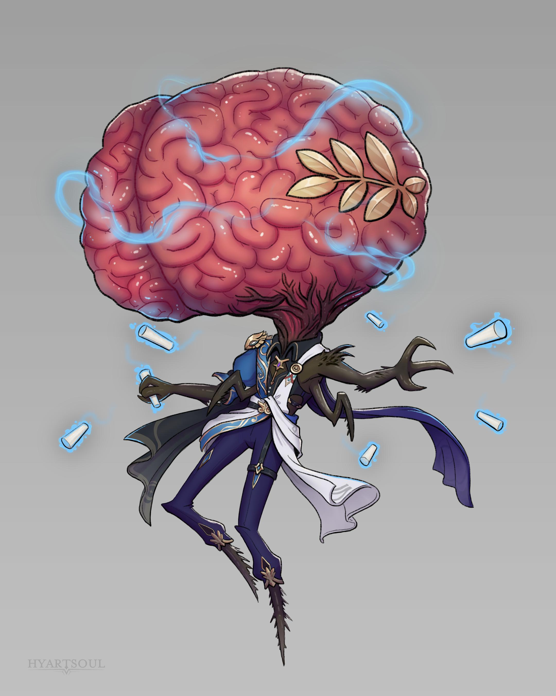

# Контемплативы (Contemplative)

### Физическое описание
Контемплативы - это парящие гигантские мозги с рудиментарным телом и слабыми конечностями. Их мозг покрыт плотной оболочкой, способной выдерживать большие нагрузки, а "тело" почти не приспособлено к физической деятельности. Движутся Контемплативы медленно, чаще всего парят с помощью врождённых телекинетических сил. Их голос звучит глубоко, резонируя, словно издалека, а глаза и сенсоры располагаются на нижней части тела.

!!! note "Возможно, вы..."
    - Считаете размышления высшей формой существования.
    - Нарочно усложняете задачи - просто ради тренировки интеллекта.
    - Говорите о себе как "мы", а не "я".
    - Легко погружаетесь в себя, отгораживаясь от внешнего шума.

!!! note "Вероятно, другие..."
    - Думают, что вы знаете всё и постоянно этим пользуетесь.
    - Считают вас надменным и холодным существом, которому сложно доверять эмоции.
    - Стараются держаться подальше, чтобы не стать объектом анализа или поучения.
    - Не понимают, как можно жить без тела и зачем жить только ради знаний.

### Общество и культура
Контемплативы - экстремальные индивидуалисты и интеллектуалы, одержимые поиском истины и разгадыванием сложнейших задач. В своих обществах они живут в изоляции или небольшими коммунами, погружёнными в размышления, дебаты и ментальные эксперименты. Для них честность, анализ и знание - высшие ценности.

Вместо власти или иерархии у них "созвездия умов": любая идея проходит испытание логикой, а истина рождается в бесконечных дебатах.

Среди других рас Контемплативы известны как мудрецы, гении или просто раздражающие умники, которые всегда знают, как "правильно".

Контемплативы малочисленны и территориально находятся в Содружестве Просвещения, являясь одним из субъектов (система Скептрум). 
Их редко можно увидеть вне Содружества, обычно в роли исследователей или ученых, которые преследуют собственные цели.

### Отношение к другим расам
**О Людях:**
"Любопытны, изобретательны, но суетливы. Их решения часто иррациональны, а убеждения эмоциональны. Ценим их страсть, но не всегда их выводы."

**О Лашунта:**
"Интеллектуальны и дипломатичны, умеют слушать и анализировать. Их общество напоминает наше, но у них слишком много недосказанного и политики."

**О Йсоках:**
"Остроумные, выживают любой ценой. С ними легко обсуждать детали и договариваться, но к глубоким философским вопросам быстро теряют интерес."

**Об Андроидах:**
"Хранят удивительный запас информации, стремятся к саморазвитию. Им часто не хватает саморефлексии, но они становятся отличными собеседниками, если им позволить говорить о себе."

**О Пахтра:**
"Ценят поступки больше слов, что затрудняет совместные размышления. Их приверженность традициям заслуживает уважения, но порой мешает видеть истину."

**О Весках:**
"Слишком прямолинейны. Уважают только силу и честь, а не истину. В дебатах редко выдерживают больше пары минут."

**О Ширренах:**
"Коллективный разум близок нашему ментальному обмену, но их единство порождает предсказуемость. Интересно наблюдать за их развитием."

**О Скиттермандерах:**
"Воплощённый хаос. Их мышление необычно, но иногда среди шума появляется свежая идея. Общаться утомительно, но не бесполезно."

### Имена
В изоляции Контемплативы используют ментальные сигнатуры. Для межвидового общения - звучные, длинные или философские имена, например: Третий концерт Эскари, Сонет на крыле Десны, Кости в Спирали, Последний коан Поколва, Тошу, Кастровельский парадокс.

