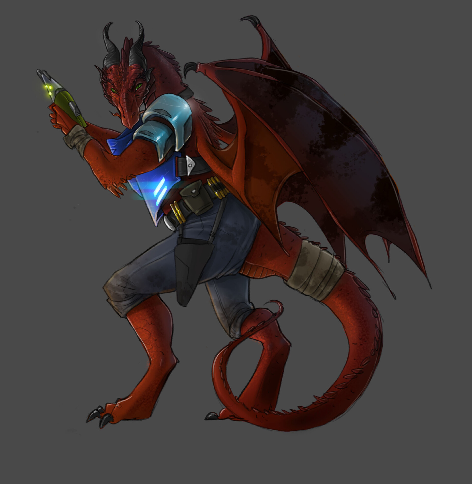

# Дракониды (Dragonkin)

### Физическое описание
Дракониды - крупные крылатые гуманоиды, покрытые толстой чешуёй, с мощными когтями, хвостом, рогами и яркими глазами. Их размеры обычно 2,5-6 метров в высоту и до 900 кг, хотя среди городских или "корабельных" Драконидов встречаются более компактные формы. Цвет чешуи может быть самым разным.

!!! note "Возможно, вы..."
    - Гордитесь своей способностью к глубоким эмоциональным связям.
    - Всегда доверяете интуиции и чувствам при выборе союзников.
    - Считаете своим долгом защищать партнёра и свой клан.
    - Ощущаете дискомфорт в одиночестве, ищете место в сообществе.

!!! note "Вероятно, другие..."
    - Восхищаются вашей силой, но побаиваются близости и вашей верности партнёру.
    - Считают вас идеальными защитниками или грозными противниками.
    - Не понимают, насколько сильна и важна для вас связь с партнёром.
    - Иногда воспринимают вас слишком просто как оружие или живой щит.

### Общество и культура
Дракониды - потомки древних союзов драконов и гуманоидов, некогда покорённых Весками и использовавшихся как элитные воины. После освобождения их миры стали частью Звёздного Совета, где Дракониды быстро освоили клановую систему Пахтр и создали свои дома в Совете. Их общество строится вокруг партнёрских уз - уникальной духовной и телепатической связи между двумя существами. Большинство Драконидов крайне социальны, лояльны своему клану и буквально не могут жить в одиночестве.
Потеря партнёра - огромная трагедия. Связь может быть платонической, романтической или семейной, но всегда очень глубокой.

Архитектура, законы, праздники и быт Драконидов - всё вращается вокруг темы партнёрства и поддержки сообщества. Даже в составе Звёздного Совета они стремятся объединять усилия ради общего блага и всегда готовы встать на защиту своих союзников.

### Отношение к другим расам
**О Людях:**
"Часто слишком индивидуалисты, но быстро учатся важности доверия и союза. Их независимость одновременно вдохновляет и раздражает."

**О Лашунта:**
"Хитрые дипломаты, умеют ценить союзников, но иногда кажутся излишне прагматичными. С уважением относятся к традициям кланов."

**О Йсоках:**
"Хорошие механики, надёжные в критических ситуациях. Им бывает трудно понять суть настоящей верности, но они быстро учатся."

**Об Андроидах:**
"Их самоотверженность и поиск своего места напоминают нашу тягу к партнёрству. Уважаем их путь, но общаемся осторожно."

**О Пахтра:**
"Соседи по дому и по крови. Наши кланы близки по духу, мы вместе отстояли свободу. Им можно доверять в бою и в быту."

**О Весках:**
"Когда-то были хозяевами - теперь противники. Их дисциплина знакома нам, но их гордость бывает опасна."

**О Ширренах:**
"Идея коллективного разума интересна, но нам ближе личные узы. Мы разделяем уважение к союзу, но не к потере индивидуальности."

**О Скиттермандерах:**
"Весёлые и дружелюбные - иногда путают нас с летающими такси или забавными зверями. Но мы относимся к ним снисходительно."

### Имена
Дракониды носят длинные имена, часто наследуют их от партнёров или предков. К примеру: Акродо, Араликс, Кахоре, Лаурвиктрикс, Фарвензи, Дарзалфен, Хераксия, Цалу, Зендегос.

Имена отражают историю клана, память о важных связях или боевых заслугах.

