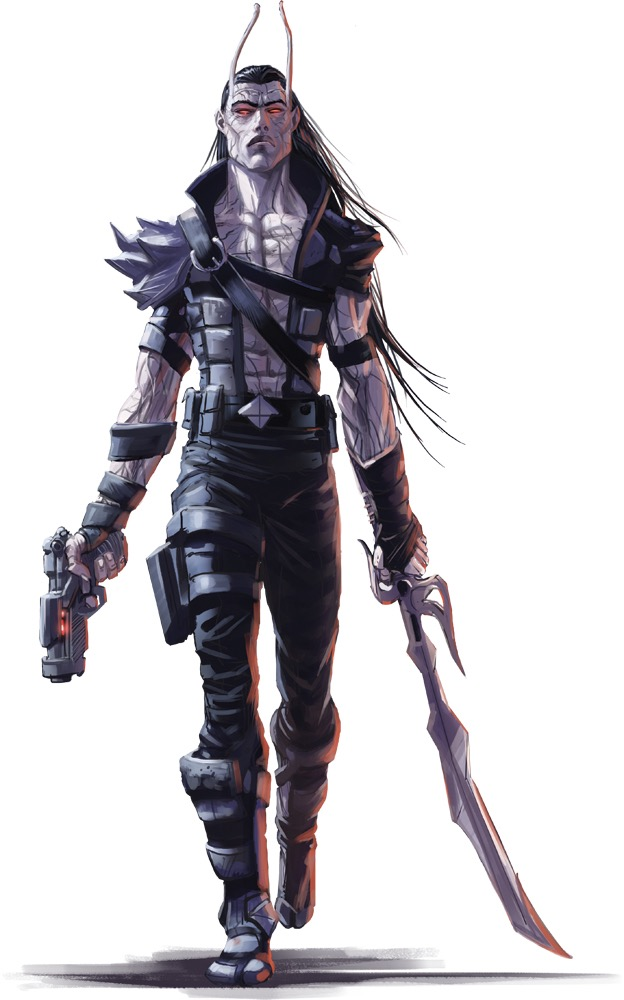

# Бораи (Borai)

### Физическое описание
Бораи выглядят почти как обычные живые представители своих рас, но их кожа нередко бледная или "восковая", а вены переливаются черноватой энергией - следами прорыва за грань смерти. Они дышат, спят, едят, стареют... и всё же что-то в них не так. В них нет той самой "искры", которую чувствуют живые друг в друге или есть что-то иное, потустороннее.

Их тело поддерживается собственным упрямым духом, не позволившим умереть окончательно. Пока эта связь существует, Борай остаётся между мирами, сохраняя себя вопреки законам природы и науки. Но рано или поздно связь рвётся. И тогда - не просто смерть, а исчезновение, как живого, так и мёртвого.

!!! note "Возможно, вы..."
    - Вернулись к жизни не потому, что кто-то звал, а потому что вы сами отказались умереть
    - Носите маску веселья или храбрости, скрывая смутное чувство утраты и пустоты
    - Готовы сделать всё, лишь бы снова чувствовать себя живым

!!! note "Вероятно, другие..."
    - Не сразу понимают, что вы не обычная нежить, и продолжают ждать от вас жуткого
    - Считают вас неестественным, даже если не могут объяснить почему
    - Путают вас с магическими экспериментами, проклятиями или кибер-ошибками

### Общество и культура
Бораи не образуют общих культур или государств. Они рождаются заново в лабораториях, при неудачных воскрешениях, магических всплесках, авариях в зоне Дрифта или на кладбищенских мирах. Часто они даже не знают, почему вернулись.

Многие пытаются вернуться к прошлой жизни, скрывая свою суть, но почти всегда это заканчивается отторжением - либо их отвергают, либо они сами чувствуют, что стали чужими. Тогда начинается путь. Борай уходит: в путешествие, к странникам, в пыльные храмы, в холодные залы станций - туда, где можно заново найти себя.

Из-за этой разбросанности Бораи часто находят семью среди таких же "потерянных" - наёмников, философов, андроидов, религиозных изгоев. Некоторые идут в дипломатию, стремясь доказать, что они живы. Другие в силовые структуры, пугая своим видом. Но все они странники, ищущие не только смысл, но и ощущение жизни.

### Имена
Большинство Бораев сохраняют свои имена из прошлой жизни, даже если от неё почти ничего не осталось. Но бывают и те, кто берёт новые имена, когда от прежнего «я» осталась лишь тень.

