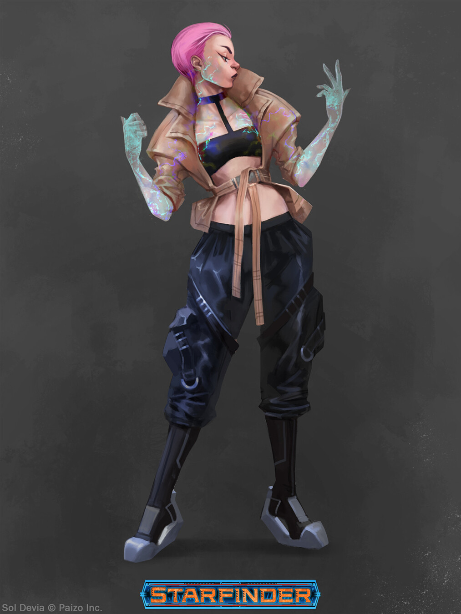

# Присмени (Prismeni)

### Физическое описание
Присмени могут принадлежать к любым расам, но с первого взгляда заметно, что они "другие": переливающаяся кожа, радужные отблески в волосах, металлический блеск в глазах или провода, встроенные в плоть. Их тела могут генерировать слабые электрические импульсы, а в Дрифте они начинают буквально светиться изнутри - становятся ярче, живее, будто находят своё настоящее я.

Точная природа их трансформации до сих пор неизвестна. Некоторые рождаются такими в Дрифте или рядом с маяками, другие становятся ими после тесного контакта с энергиями Дрифта или существами, живущими в нём.

!!! note "Возможно, вы..."
    - Не выносите рутины и стремитесь к переменам во всём.
    - Чувствуете себя дома в Дрифте — странном гиперпространстве, где царят покой и свобода.
    - Спонтанно принимаете решения, доверяя внутреннему зову, а не логике или традициям.

!!! note "Вероятно, другие..."
    - Считают вас нестабильными или непредсказуемыми.
    - Думают, что вы верите в Триуну или являетесь последователем спектров.
    - Уверены, что вы умеете управляться с любой технологией «интуитивно».

### Общество и культура
Присмени редко остаются на одном месте. Их не интересуют традиции или стабильность - они живут в движении. Многие из них никогда не заводят настоящего дома, часто меняют работу, окружение, даже внешность и имя. Вместо сообществ у них возникают мимолётные "вспышки встреч" - спонтанные сборы, словно по зову Дрифта, обычно у маяков или других значимых точек. Никто не знает, случайны ли они или это воля высших сил.

Многие из них придерживаются философии полной свободы и атеизма. Главное для них не останавливаться.

Их ценности: личный выбор, внутреннее чутьё, открытость к новому. Они с лёгкостью отпускают старые связи, но так же легко открываются новым. Если кто-то мешает им двигаться вперёд, они уходят.

### Имена
У Присмени нет фиксированных имён. Большинство меняют своё имя хотя бы раз - чаще всего в подростковом возрасте, а иногда и в зрелости, когда чувствуют, что "стали кем-то новым". Им нравятся как звучные, почти сценические прозвища, так и странные комбинации звуков, в которых только они видят смысл.

Примеры: Анаон, Связь, Глитч, Лейсиум, Эцци, Красный, Восьмое, Ноль, Бесконечная, Искра, Цикл, Ун, Ми-6.

