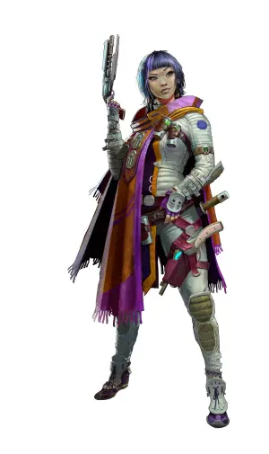

# Люди (Humans)

### Физическое описание
Люди - одна из наиболее разнообразных рас галактики: цвет кожи, форма черепа, оттенки глаз, волос, рост и комплекция могут значительно различаться. За тысячелетия адаптации и смешения культур они привыкли жить в любых условиях: от густонаселённых мегаполисов Земли до заброшенных станций на окраинах цивилизации.

!!! note "Возможно, вы..."
    - считаете, что любой вызов - это шанс стать лучше
    - легко меняете убеждения и привычки, если обстоятельства требуют
    - стремитесь оставить след в истории, даже если для этого придётся "обходить правила"
    - вдохновляете других, даже если иногда не знаете, куда идти сами

!!! note "Вероятно, другие..."
    - Думают, что вы слишком быстро бросаетесь в новое, забывая о прошлом
    - Думают, что вы постоянно спорите друг с другом, даже если речь идёт о мелочах
    - Думают, что вы склонны к экспансии, конкуренции и контролю
    - Думают, что вы умеете договариваться, только если в конце ждёт прибыль

### Общество и культура
Космическая Федерация изначально создавалась людьми для людей, но быстро превратилась в смешанное общество. Несмотря на официальный мультикультурализм, люди удерживают большинство ключевых постов в правительстве, корпорациях и научных институтах.

Для человеческой культуры характерна амбиция и прагматизм. Они ценят личный успех, открыты к новым технологиям, умеют использовать слабости системы, а иногда её взламывать.
Среди людей много карьеристов, исследователей, изобретателей, дипломатов и политиков.

Их общество - вечная арена для споров, реформ, революций и компромиссов. Здесь рождаются как самые смелые идеи, так и самые опасные авантюры. Люди склонны создавать союзы, чтобы их тут же нарушать, верить в идеалы, чтобы их тут же менять, и даже в самых тяжёлых условиях искать выгоду для себя и своих.

### Отношение к другим расами
**О Лашунта:** "Лашунта - единственные, с кем можно по-настоящему договориться. Да, странные, да, дипломатия у них слишком сложная, но в конце концов они почти как люди, только с антеннами. Хорошие партнёры, умные, умеют делать бизнес и держать слово."

**О Йсоках:** "Йсоки - крысы и есть крысы. Шустрые, неубиваемые, полезные в инженерии и на тяжёлых работах. Своё место знают, не лезут в политику. Пусть выживают - это выгодно."

**Об Андроидах:** "Андроиды - технари и расходники. Вроде как разумные, но кто в это верит? Пока работают - пусть работают. Права им дали только чтобы не устроили бунт, но настоящей свободы у них нет и не будет."

**О Пахтра:** "Пахтра - те самые кошки, которым однажды слишком повезло. Были бы по-прежнему под Весками, если бы не наши корабли. Их территории и ресурсы должны были бы принадлежать Федерации, если бы не вмешались Лашунта. Теперь придётся наблюдать, пока не ошибутся."

**О Весках:** "Вески - ящеры-фанатики. Воевать умеют, но мозги промыты религией, как в каменном веке. Война с ними показала, что у них силы много, но ума мало. Территории опасны, да и доверять им нельзя."

**О Ширренах:** "Ширрены - странные жуки. Постоянно твердят о коллективе и благополучии, не понимают простых вещей: выгоды, амбиций, власти. Работают нормально, но всегда немного пугают своей стайностью."

**О Скиттермндерах:** "Скиттермандеры - пушистый фон, не мешают, иногда помогают, главное, чтобы не суетились под ногами."

### Имена
Имена людей могут быть любыми: от традиционных земных до новых, возникших в колониях или среди смешанных семей. Часто встречаются простые имена: Эмили, Давид, Сун-Хи, Рави, Амир, но бывают и многосоставные, и заимствованные у других рас.

