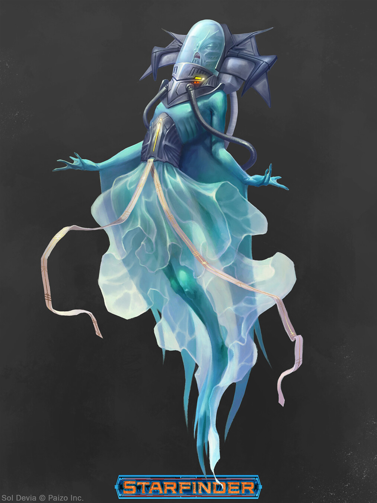

# Кало (Kalos)

### Физическое описание
Кало - стройные водные гуманоиды с чешуёй синих, зелёных или перламутровых оттенков, лёгким хрящевым скелетом, полупрозрачными перепонками между пальцами и биолюминесцентными глазами. Их лица украшены сенсорными щупальцами и декоративными гребнями, которые они любят модифицировать.

Вне воды кало нуждаются в специальной экипировке или регулярных погружениях, чтобы поддерживать здоровье кожи и жабр.

!!! note "Возможно, вы..."
    - Считаете искусство и бой разными гранями одной гармонии.
    - Чувствуете себя в своей стихии только под водой.
    - Самовыражаетесь через стиль, украшения и творчество.
    - В любой ситуации стремитесь выглядеть ярко и достойно.

!!! note "Вероятно, другие..."
    - Поражены вашей грацией и боевыми навыками.
    - Думают, что вы слишком свободолюбивы для служения идеалам Содружества.
    - Ожидают от вас совета по внешнему виду или творчеству.
    - Считают, что на суше вы чувствуете себя чужими.

### Общество и культура

Кало веками развивали уникальную культуру, сочетающую воинскую дисциплину, искусство и коллективизм. Их военная традиция началась с восстания против Линнормов (Драконоподобных существ, пришедших из Первичного Мира) и до сих пор остаётся частью национальной гордости.
Современные мегаполисы Кало - это центры искусства, высоких технологий и ремёсел, где каждый стремится выразить себя и оставить свой след.
В Содружестве Просвещения Кало - самая независимая и сплочённая группа. Они участвуют в общих делах, но никогда не забывают о собственных интересах и всегда готовы дать отпор даже союзникам, если считают, что их независимость или искусство под угрозой.

### Отношение к другим расам
**О Людях:**
"Стремительны, но грубы и предсказуемы. Их изобретательность восхищает, но их безразличие к гармонии часто сбивает с толку."

**О Лашунта:**
"Наши союзники и покровители, но не наши наставники. Их дипломатия полезна, пока не переходит в навязывание идеалов."

**О Йсоках:**
"Умеют находить красоту даже в хаосе. Иногда их практичность кажется нам примитивной, но они надёжны в сражении."

**Об Андроидах:**
"Больше художники, чем воины. Их креативность в выборе формы и материалов вдохновляет и немного пугает."

**О Пахтра:**
"Их грация на суше напоминает нашу в воде. Уважаем их кланы, хотя их укоренённость в прошлом иногда ограничивает."

**О Весках:**
"Сильны, но слишком прямолинейны. Любят демонстрировать мощь, забывая о красоте и нюансах."

**О Ширренах:**
"Коллективное мышление им близко, но нам чуждо. Впрочем, они не вмешиваются в наши дела."

**О Скиттермандерах:**
"Беспокойные, шумные, но вносят свежий поток идей. В воде их мало, но мы рады их обществу на суше."

### Имена
Часто образуются из мелодичных или редких сочетаний, нередко — с уважением к историческим личностям:
Хуур-Литу, Олаавху, Шавхиул, Шуутхул, Уллуумот

