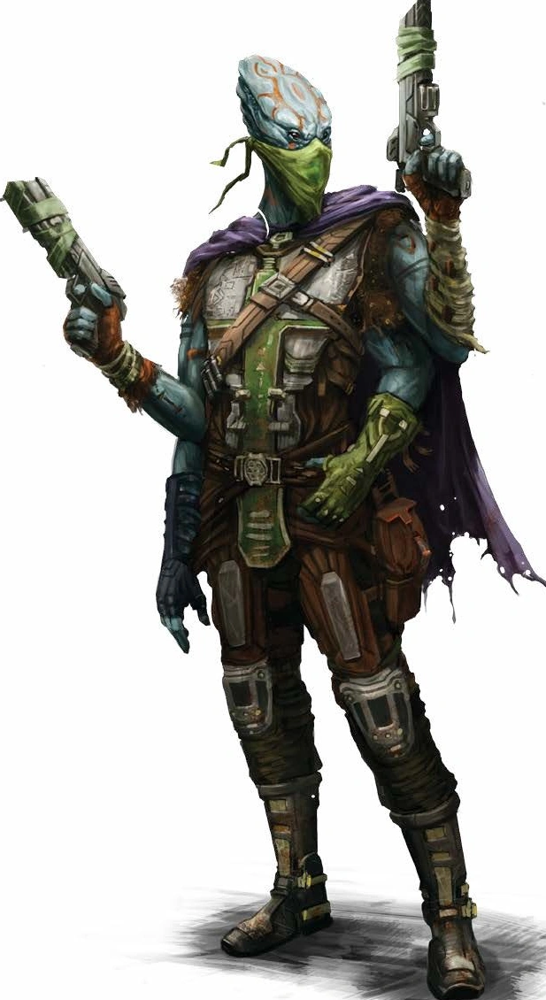

# Касатха (Kasatha)

!!! note "Возможно, вы..."
    - Считаете себя хранителем древних традиций, даже находясь среди чужих культур.
    - Стремитесь соблюдать обычаи своего народа, несмотря на искушения нового мира.
    - Видите миссию в том, чтобы делиться мудростью с другими, не теряя свою идентичность.
    - Склонны оценивать новое с осторожностью и уважением к предкам.

!!! note "Вероятно, другие..."
    - Считают вас отстранёнными и немного надменными.
    - Восхищаются вашим долголетием и самообладанием.
    - Считают ваш уклад жизни архаичным или странным.
    - Опасаются вашего технологического могущества и скрытых знаний.

### Физическое описание
Касатха высокие (1.9–2.4 м) четырёхрукие гуманоиды с тёмной гладкой кожей, длинными черепами и выразительными глазами. Их движения плавные и сдержанные, речь мелодичная, с оттенком древней формальности. Большинство Касатха носят свободные плащи, покрывающие всё тело, и тщательно скрывают лица за вуалями, считая это проявлением уважения и достоинства.
Возраст Касатха часто невозможно определить по внешности: старейшины могут выглядеть почти так же, как юные. Они живут 180–250 лет.

### Общество и культура
Касатха - народ-странник, покинувший свой родной мир из-за неизвестной катастрофы. Их гигантские ковчеги-корабли пересекли огромные расстояния, пока не достигли этой галактики. В обмен на возможность жить здесь они раскрыли тайны Дрифта - плана и технологии для открытия порталов на него, изменившей всю цивилизацию галактики.

Внутри своих ковчегов Касатха хранят строгую иерархию: старейшины, родовые советы, жрецы знаний и воинов. Каждый Касатха с детства впитывает уроки предков, иерархию уважения, долг перед кланом и традиции странствий. Они редко вмешиваются в дела других рас, предпочитая наблюдать, анализировать и только затем действовать.

Касатха ценят контроль над собой, считают скромность достоинством, но ради дела способны на дерзкие поступки. Многие из них стали уважаемыми советниками или учёными в других мирах, но всегда хранят ядро своей культуры.

### Отношение к другим расами

**О Людях:** 
"Амбициозны, нетерпеливы, часто не видят последствий своих решений. Но в их стремлении есть энергия, которой не хватает старым народам. Осторожность в общении и уважение к традициям открывают двери к их доверию."

**О Лашунта:**
"Близки к нам по уважению к культуре и истории, но часто слишком прагматичны. В их дипломатии есть что-то родственное нашим советам, если не забывать, что в каждом слове скрыто намерение."

**О Йсоках:**
"Гибкие, находчивые, прекрасно адаптируются к любым обстоятельствам. Иногда напоминают молодёжь, что не терпит ограничений, но заслуживают доверия в технических вопросах."

**Об Андроидах:**
"Почти вечные странники, ищущие себя. Уважаем их терпение и философию перемен, но не всегда понимаем их тягу к смене форм и идентичностей. Взаимное любопытство сближает, но настороженность сохраняется."

**О Пахтра:**
"Вольнолюбивы и горды, как и наш народ был в юности. Их уважение к истории и духу клана понятно нам, но часто их поступки кажутся чрезмерно эмоциональными."

**О Весках:**
"Воины, чьё рвение к победе мешает им задуматься о смысле. Их честь достойна уважения, но враждебность и неизменность культуры осложняют сотрудничество."

**О Ширренах:**
"Искренние, но слишком коллективны. Их поиск гармонии вызывает уважение, но мы ценим индивидуальность. Тем не менее, опыт их народа напоминает нам, что выжить можно только вместе."

**О Скиттермандерах:**
"Беззаботные, непредсказуемые, шумные. Но именно их энтузиазм иногда напоминает, как важно не забывать радость даже среди великих испытаний."

### Имена
Имена Касатха - отражение их почтения к предкам, клановой принадлежности и исторической памяти. Обычно они состоят из личного имени и кланового или родового суффикса, иногда с добавлением чести или титула. Длинные имена считаются признаком уважения к роду: чем больше элементов, тем древнее линия.

Молодые Касатха часто носят только личное имя (например, Ашал, Лиссара). Взрослые добавляют имя рода или клана (например, Веккос Деран’Кас - Веккос из рода Деран’Кас). Старейшины могут носить целую вереницу имен, где каждое новое достижение или особая заслуга становится частью их титула.

Примеры:
Ашал, Тисарет, Веккос, Деран’Кас, Лиссара, Шарин, Ом’Тар, Кэзарин, Йалама, Ваксур, Касо’Тха.

Примеры длинных:
Тисарет Ом’Тар из дома Кэзарин, Ашал-Касо’Тха хранитель Песков.

