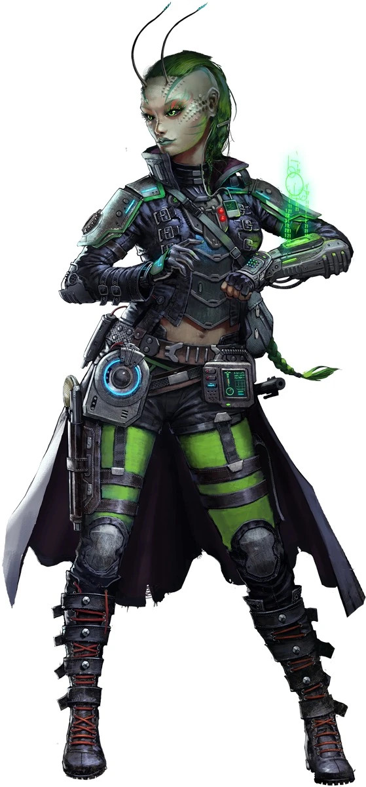

# Лашунта (Lashuntas)

### Физическое описание
Лашунта - грациозные гуманойдные существа с антеннами, обеспечивающими псионическую чувствительность. Их тела отличаются элегантностью, а движения осознанной мягкостью. Они рождаются в одной из двух морфологических форм: Дамайя - высокие, стройные, с предрасположенностью к науке и дипломатии, и Корашу - низкорослые, жилистые, с талантом к разведке и военному делу. Выбор формы часто связан с внутренними стремлениями, а не только генетикой.

!!! note "Возможно, вы..."
    - Всегда ищете разумное и мирное решение даже в самых напряжённых ситуациях.
    - Верите, что прогресс и взаимопомощь могут превзойти силу.
    - Воспринимаете любой конфликт как шанс выстроить более стабильные отношения.
    - Оттачиваете свои аргументы так же тщательно, как другие клинки

!!! note "Вероятно, другие..."
    - Думают, что вы слишком умны, чтобы быть просто добрыми.
    - Думают, что вы умеете убедить кого угодно в чём угодно — даже если он был уверен в обратном
    - Думают, что вы всегда «помогаете» так, что в итоге получаете больше, чем дали
    - Думают, что вы имеете скрытые цели даже в самых бескорыстных поступках

### Общество и культура
Содружество Просвещения - это свободное объединение миров, связанных общей культурой взаимопомощи, научного прогресса и дипломатии. Лашунта верят в силу разума, диалога и обмена знаниями как основу межзвёздной гармонии.

С раннего детства граждан обучают искусству выражения мысли, уважения к чужим традициям и, что особенно важно, поиску взаимной выгоды. Помогать другим считается не просто добродетелью, но и естественным шагом к построению прочных, взаимовыгодных отношений.

"Лучшее решение - то, где выигрывают все." - поговорка, широко распространённая среди лашунта

Именно поэтому представители этой расы часто становятся послами, посредниками в переговорах и главами программ помощи пострадавшим регионам. Многие крупные нейтральные организации в галактике были основаны или вдохновлены ими.

При этом ни один договор, заключённый лашунта, не будет для них убыточным - искусство дипломатии у них в крови.

### Влияние и дипломатия
Лашунта обладают выдающимися псионическими способностями, особенно в сфере эмпатии, что позволяет им интуитивно чувствовать намерения собеседника и выстраивать эффективные линии общения. Эти способности формируют культурную основу их общества, где искренность и мягкое убеждение ценятся выше принуждения.

В их культуре считается невежливым навязывать свою волю напрямую, но мастерски выстроенный диалог, при котором собеседник сам приходит к "правильному выводу" - признак высшего мастерства.

### История
После периода конфликтов и научных разногласий на родном мире, лашунта пришли к идеалу просвещённого сосуществования. Они отказались от насильственной экспансии в пользу идеологического влияния, распространяя свои принципы через школы, академии, миссии помощи и взаимовыгодные соглашения.

Содружество Просвещения не имеет централизованной власти в привычном смысле, но объединено философией, которую разделяют почти все члены общества. Это позволяет им действовать удивительно слаженно, особенно когда нужно решать чужие конфликты.

### Военное дело
Хотя лашунта не склонны к прямому насилию, их агенты среди разведки, безопасности и информационных служб обладают высоким уровнем подготовки. Если дипломатия терпит неудачу, они предпочитают тактические, точечные действия - с минимумом жертв и максимумом эффективности.

Многие представители корашу служат в аналитических и тактических подразделениях, специализируясь на нейтрализации угроз до того, как они станут проблемой.

### Отношение к другим расам
**О Людях:**
"Переменчивые, но предсказуемые - удобные партнёры, если умеешь предугадывать их следующий шаг. Главное не дать им почувствовать себя обманутыми."

**Об Андроидах:**
"Хорошо делают свою работу и редко спорят, если им дать достаточно свободы. Важно помнить: у них есть душа и, возможно, амбиции."

**О Йсоках:**
"Слишком суетливы, но их энтузиазм и скорость часто приносят пользу. Иногда проще уступить и потом предложить лучшее решение."

**О Ширренах:**
"Их желание достичь компромисса иногда раздражает, но это открывает множество возможностей для дипломатии."

**О Пахтра:**
"Сильные, гордые и прямолинейные - лучше договариваться на их условиях."

**О Весках:**
"Грозные, но предсказуемые. Если не влезать в их дела, они не полезут в твои."

**О Скиттермандерах:**
"Милые, но беспокойные существа. Иногда мешают, но если правильно направить приносят удивительную пользу."

### Имена
Лашунта выбирают имена, отражающие личные цели или наследие. Часто встречаются длинные и мелодичные формы, иногда дополненные титулом, указывающим на род занятий, достижения или образовательную степень.

