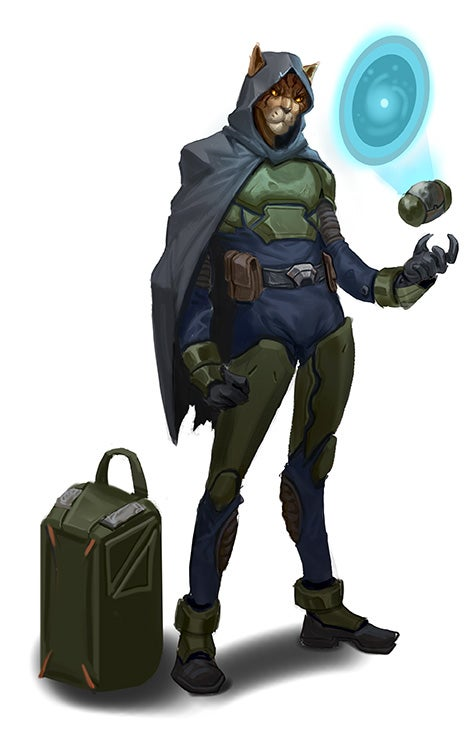

# Пахтра (Pahtras)

!!! note "Возможно, вы..."
    - гордитесь своими корнями, даже если не принадлежите к известному клану
    - верите, что достоинство выражается не в словах, а в поступках
    - стремитесь сохранить и передать традиции, не теряя при этом свободу
    - никогда не забываете, кто дал вам руку в трудный час — и кто пытался сломать вас

!!! note "Вероятно, другие..."
    - Думают, что вы слишком упрямы, даже когда речь идёт о простых вопросах
    - Думают, что вы живёте прошлым и не умеете идти вперёд
    - Думают, что вы недоверчивы, особенно к чужакам
    - Думают, что вы непростительны, если вам солгали - даже однажды

### Физическое описание
Пахтра - гибкие, кошкоподобные гуманоиды с острым слухом, быстрыми рефлексами и развитым чувством ритма. Их мех варьируется по цвету и узору, часто отражая происхождение из определённого клана. Мелкие движения, хвостовая балансировка и природная грация делают Пахтра превосходными разведчиками, воинами ближнего боя и пилотами.

Их движения изящны даже в быту, но в бою превращаются в смертоносный танец. Благодаря природной гибкости и ловкости, Пахтра особенно ценят тактическое движение и использование окружающей среды.

### Общество и культура
До появления межзвёздных контактов Пахтра жили в независимых кланах, часто воюя между собой за территорию, ресурсы и влияние. Несмотря на частые конфликты, культура кланов ценила честь, личную силу и верность роду. Каждый клан имел свои традиции, диалект, боевые практики и обряды инициации.

Однако в 2100-х годах (по человеческому летоисчислению) их планета была покорена Теократией Единства. В течение нескольких веков Вески пытались стереть клановую структуру, используя жёсткую милитаризацию, культурную ассимиляцию и рабский труд. Но Пахтра не сломились, сохраняя песни, символы и уроки предков даже в лагерях.

Парадоксально, но именно оккупация Весков научила Пахтра обращаться с космическими технологиями - пусть и как рабов на заводах. Разрозненные кланы, насильственно распределённые по разным колониям, в итоге получили шанс для координации и связей, ранее невозможных.

В 2250 году, после более чем столетия оккупации, Вески начали подготовку к наступлению на Ширренов, перебрасывая большую часть своего флота к границе. Пахтра, уловив момент, тайно передали информацию о готовящейся атаке Лашунта - через анонимные каналы. Когда началось наступление, флот Весков столкнулся с подготовленным объединённым флотом Космической Федерации, скоординированным Лашунта. Одновременно Пахтра подняли восстание на множестве колоний, в момент, когда Вески остались без поддержки.
Это стало не просто провалом военной кампании: Вески потеряли почти половину своих систем, и те, что освободились, вскоре объявили о создании Звёздного Совета.
Чтобы окончательно закрепить независимость, Пахтра уничтожили маяк Дрифта в системе AS-30 - это сделало невозможным быстрый ответ Весков.

### Звёздный Совет Пахтра
Сегодня Пахтра управляются через Звёздный Совет - конфедеративный орган, куда входят представители всех признанных кланов. Каждый клан сохраняет автономию, но решения, касающиеся дипломатии, обороны и межзвёздной торговли, принимаются Советом.

Централизации они избегают сознательно, помня цену оккупации. Первый Голос Совета выполняет роль координатора, но не обладает абсолютной властью. Все решения принимаются голосованием, при котором у каждого клана один голос, независимо от численности или влияния.

### Традиции и военное дело
Современные Пахтра не агрессивны, но гордятся своим воинским наследием. Ритуальные поединки, демонстрации боевых стилей, поэтические хроники побед и поражений - всё это по-прежнему занимает важное место в жизни. Для них бой - не средство насилия, а форма выражения достоинства и силы духа.

Многие молодые Пахтра проходят обучение в боевых школах своего клана, где наряду с боевыми приёмами изучают этику, риторику и наследие рода. Среди наёмников и пилотов Пахтра славятся как честные, быстрые и надёжные бойцы, но далеко не наивные.

### Отношения с другими расами
К Вескам отношение сохраняется настороженное, порой враждебное. Хотя формально дипломатические каналы открыты, ни один Веск не может свободно путешествовать по Уловару без разрешения Совета.

К Лашунта и Федерации - сдержанная благодарность. Пахтра ценят оказанную помощь, но не желают новой зависимости.

К другим расам - нейтралитет, пока не доказано обратное. Но уважение быстро растёт, если собеседник проявляет достоинство и не относится к Пахтра свысока.

### Имена
Имена Пахтра часто отражают происхождение или клановую историю: Лаури’тан, Кеш’мир, Орок’нэл, Тиа’зира. Некоторые используют двоичную форму: имя + клан, например: Саэн из Песчаной Лапы, Гар'ол из Каменного Ветра.

