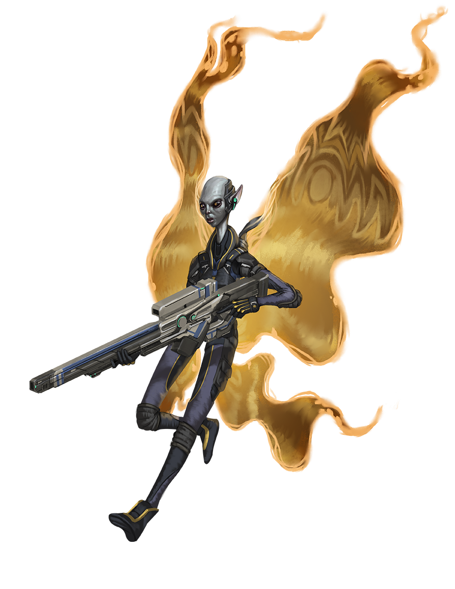

# Сарсесианы (Sarcesians)

### Физическое описание
Сарсесианы - высокие, стройные гуманоиды с серой кожей, крупными светящимися глазами и длинными тонкими конечностями. Их рост от 3 до 4,5 метров, но строение лёгкое и гибкое. В вакууме они способны проявлять крылья бабочки из энергии, которые используют как солнечные паруса.

Сарсесианы могут задерживать дыхание и выживать в открытом космосе до часа (или дольше в зависимости от наследия). Одежду предпочитают практичную, обычно скрывающую почти всё тело, но часто украшают лицо ярким макияжем.

!!! note "Возможно, вы..."
    - Чувствуете себя дома только под открытым звёздным небом.
    - Быстро находите общий язык с незнакомцами, но избегаете лидерских ролей.
    - Предпочитаете тишину космоса шуму цивилизации.
    - Спокойно принимаете одиночество, когда это ваш выбор.

!!! note "Вероятно, другие..."
    - Думают, что вы способны жить в космосе неделями безо всякой поддержки.
    - Считают вас чудаковатыми или нелюдимыми — хотя на деле вы просто не навязываетесь.
    - Полагают, что вы склонны исчезать без предупреждения, а потом появляться внезапно.

### Общество и культура
Сарсесианы - космические кочевники, которые живут, занимая астероиды, обломки и небольшие купольные города. Они не признают властей и законов, не участвуют в политике Содружества Просвещения и не имеют официального представительства. Их поселения часто автономны, а сами сарсесианы придерживаются принципа максимальной личной свободы и уважения к свободе других.

Внутри общества превалирует дух индивидуализма и отсутствие давления на соседей: никто не навязывает свой путь и не ждет подчинения. Лидерство встречается редко и воспринимается как добровольная роль, но чаще всего вопросы решаются консенсусом или по принципу "делай как знаешь".

Семья и близкие связи ценятся, но традиционные браки или семейные модели встречаются редко: каждый выбирает свою дорогу. Воспитанием детей занимаются специальные наставники.

Многие сарсесианы - отличные пилоты, навигаторы, снайперы и инженеры, поскольку их образ жизни требует постоянной адаптации к переменам и опасностям.

### Отношение к другим расам
**О Людях:**
"Полны амбиций и суеты. Хорошие компаньоны в коротких приключениях, но жить с ними рядом - слишком шумно."

**О Лашунта:**
"Они ценят мудрость, но слишком любят управлять, а мы не терпим чужого контроля."

**О Йсоках:**
"Любопытные и практичные. С ними легко договариваться."

**Об Андроидах:**
"Понимают одиночество и странствия. С ними приятно молчать рядом."

**О Пахтра:**
"Стремятся к сплочённости и традициям - нам это чуждо, но уважаем их за честность."

**О Весках:**
"Слишком прямолинейны и воинственны. Стараемся держаться подальше от их конфликтов."

**О Ширренах:**
"Часто заботятся о других даже больше, чем нужно. Уважаем, но сами так не можем."

**О Скиттермандерах:**
"Никогда не устают и всегда суетятся. Их энтузиазм иногда утомителен."

### Имена
Сарсесианские имена не следуют строгим правилам, выбираются по звучанию или личной ассоциации.
Примеры: Альзарин, Фавьенна, Дезарин, Менгиан, Вокс, Зунар, Рисирия, Висавра, Мираи.

