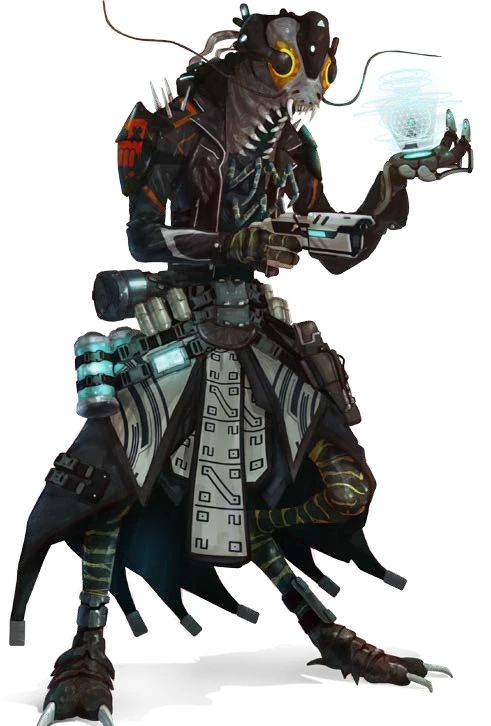

# Ширрены (Shirren)

!!! note "Возможно, вы..."
    - чувствуете себя частью чего-то большего и находите в этом опору
    - спокойно уступаете инициативу, если видите, что кто-то нуждается в ней больше
    - оцениваете решения не по выгоде, а по их влиянию на общее благо
    - доверяете системе, потому что эта система - вы сами и те, кого вы любите

!!! note "Вероятно, другие..."
    - Думают, что вы не пугающе коллективны
    - Думают, что вы не способны к амбициям
    - Думают, что вы опасно наивны
    - Думают, что вы прячете свою индивидуальность в общей массе

### Физическое описание
Ширрены - насекомоподобные гуманоиды с хитиновым панцирем, крупными составными глазами, усиками и внутренней симметрией тела. Их тела отличаются грацией, а движения осторожностью. Речь Ширренов может сопровождаться легким щелчком челюстей и колебаниями усиков, передающими эмоции.

Их физиология включает остаточные ментальные каналы, ранее использовавшиеся для связи с Роем. После освобождения эти каналы адаптированы под добровольный обмен эмоциями и мыслеволнами между близкими Ширренами.

### Общество и культура

Ширрены были частью единого Роя - огромного разума, подчиняющего каждую особь общему контролю. Однако в момент, известный как Расщепление, многие из них обрели индивидуальное сознание. Этот переход сопровождался духовным кризисом, но также дал им новый смысл: быть частью чего-то общего добровольно.

Они создали Коллектив - общество, в котором решения принимаются через распределённые каналы консенсуса. Каждый имеет право голоса, каждый может быть услышан, а общая воля становится законом. Здесь нет иерархий, лидеров или принуждения - только добровольное участие, забота и вклад.

Ширрены не стремятся к завоеваниям. Их экспансия культурная. Они создают станции помощи, медиаторские платформы и школы координации. Они связующая ткань галактики, даже если её никто не просил.

### Коллектив
Коллектив - это не просто государство, это среда жизни. Все блага распределяются по потребности, ресурсы хранятся и перераспределяются на основе алгоритмов общего доступа, а конфликты решаются до того, как становятся серьёзными.

У Коллектива нет сильной армии или экономического влияния. Но у него есть внутреннее спокойствие, доверие и беспрецедентный уровень жизни, которого другие державы достигают лишь в легендах.

В критических ситуациях Коллектив может создавать временное оперативное управление, но даже оно обязано сверяться с платформами резонанса и отчитываться перед обществом.

### Отношения с другими расами
К Лашунта и Пахтра: тёплое сотрудничество, особенно после исторической помощи.

К Вескам: осторожность и философское отторжение.

К Федерации: прагматичный диалог - Ширрены не верят в власть капитала, но признают полезность кооперации.

### Имена
Имена Ширренов часто передают смысловую структуру или индивидуальный образ, принятый в момент обретения свободы. Они могут звучать как: К’Нарасс, Джик-Тала, Мерса'Ко, Элик’Сет. Многие добавляют себе дополнительные смысловые идентификаторы: К'Тала из круга Эхо, Джирик-Советник Сети Соглашения.

