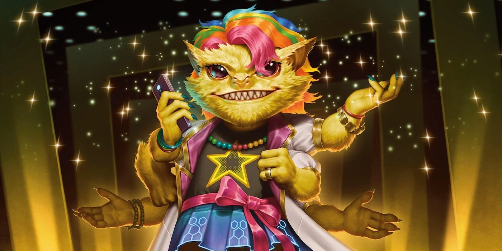

# Скиттермандеры (Skittermanders)

!!! note "Возможно, вы..."
    - всегда находите, чем помочь, даже если никто не просил
    - перебиваете себя от желания рассказать все и побольше
    - считаете, что совместная работа - лучшая форма дружбы
    - спокойно меняете профессию, цель и направление пять раз за день. Но с пользой!

!!! note "Вероятно, другие..."
    - Думают, что вы не не умеете сидеть спокойно даже минуту
    - Думают, что вы не слушаете, пока кто-то говорит, а просто ждёте своей очереди говорить
    - Думают, что вы вечно вмешиваетесь, но… как ни странно, это помогает
    - Думают, что вы существуете на кофеине и желании обнимать

### Физическое описание
Скиттермандеры - невысокие, пушистые шестирукие существа с яркими глазами, острой мордочкой и бесконечной энергией. Их мех может быть окрашен во что угодно: от пастельно-розового до кислотно-зелёного, иногда с блёстками, и часто украшен чем-то вроде "полезного инвентаря" - ленты, баночки, отвертки, непонятные штуки.

Они всегда в движении. Даже старые Скиттермандеры редко бывают спокойными - они просто становятся мудрыми в своей гиперактивности.

### Общество и культура
Скиттермандеры никогда не создавали централизованного государства, потому что им это... просто не приходило в голову. Их родная планета, находящаяся в системе Чуррос (названной в честь любимого местного десерта), состояла из множества деревень, поселений и мобильных станций, в которых каждый делал то, что считал нужным, и почти всегда это было полезно.

Когда рядом с их системой Ширрены основали Коллектив, Скиттермандеры даже не заметили, что теперь живут "в чьей-то сфере влияния". Они начали помогать в инженерных хабах, устраивать вечеринки в медицинских станциях, чинить что-то у Ширренов и снабжать их советами, которых никто не просил. Ширрены, будучи терпеливыми и эмпатичными, не возражали. И с тех пор Скиттермандеры стали естественной частью Коллектива, хотя формально так и не вступили.

### Распространение в галактике
Любознательность и врождённая тяга к "просто посмотреть, а потом остаться" сделали Скиттермандеров одной из наиболее широко расселённых рас. Они есть повсюду - на станциях Федерации, на рынках у Пахтра, в храмах Весков (часто по ошибке), и почти всегда в инженерных отсеках, где они чинят что-то весело, с песней и... без документации.

Они не колонизируют, не завоёвывают, не борются за независимость - они просто появляются и встраиваются, если их не прогоняют (а прогнать сложно - они улыбаются и протягивают гаечный ключ).

### Отношения с другими расами
**Ширрены:** "Классные! С ними приятно работать - они всегда спокойные, слушают до конца, даже когда ты перебиваешь себя три раза! Иногда грустные, но это потому что думают о важном. Мы им помогаем, а они нам дают вкусные вещи и тихие комнаты."

**О Пахтра:** "Очень серьёзные! Но если приносить им чай, они улыбаются. Иногда просят не трогать вещи, а потом всё равно берут, что мы чиним. Мы уважаем! У них есть классные истории."

**О Лашунта:** "Умные! Но немного напряжённые. Им всё нужно по плану, по порядку, по графику... Ну, мы стараемся! Когда они объясняют, что делать, обычно всё работает. Мы любим быть в их миссиях! Там много всякого."

**О Весках:** "Они как огромные шипастые скалы. Говорят громко, не улыбаются. Но когда у них что-то ломается - тогда говорят "быстро". Мы чиним. Потом они кивают. Это значит спасибо! Наверное."

**Об Андроидах:** "Загадочные! Говорят мало, но смотрят как будто всё понимают. Мы показываем, как работает штука, а они делают лучше! Очень удобно работать вместе. Иногда мы спрашиваем: "Ты злишься?" - а они отвечают: "Нет, просто думаю". Нам нравится думать вместе!"

**О Людях:** "Обожают всё новое! Часто зовут на помощь, а потом спрашивают, как мы это сделали. Говорят быстро, иногда спорят друг с другом, но всегда зовут на обед! С ними интересно - у них всегда новые проекты."

**О Йсоках:** "Супер-изобретатели! Почти как мы, только иногда аккуратнее. Делают смешные штуки, которые взрываются (но редко сильно). Любят рассказывать истории про большие города, а потом спрашивают: "Ты видел вот это?" - и показывают что-то интересное! Отличные друзья для приключений и починки чего угодно."

### Имена
Имена Скиттермандеров — короткие, яркие, часто с повторяющимися звуками: Лу, Глим, Нананан, Рекки, Тык-тык

Некоторые добавляют фразы, описывающие их характер или текущую цель: «Зу, который умеет всё!», «Блинк, собирающий мусор ради науки», «Глим, специалист по проводам (в основном красным!)»

