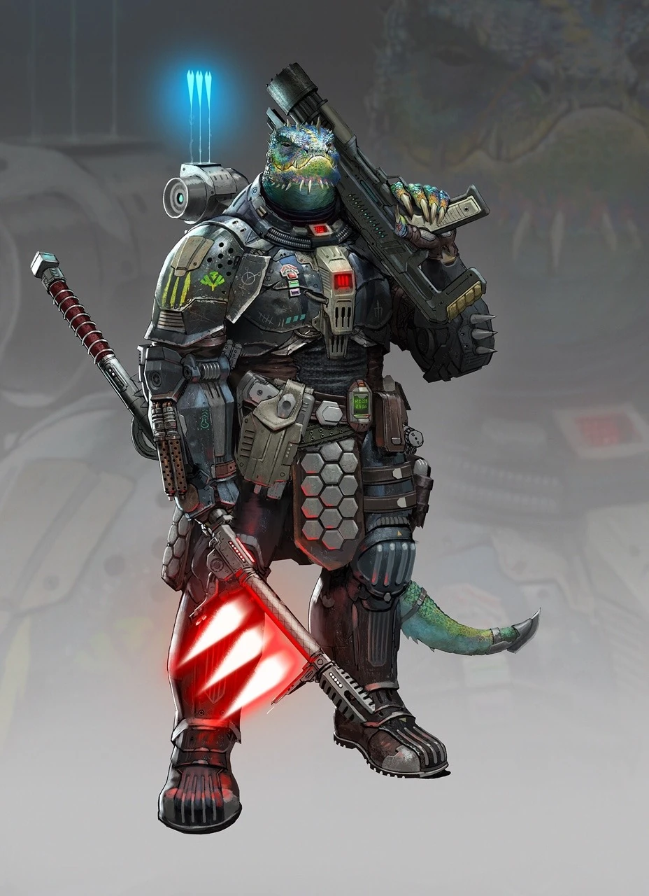

# Вески (Vesks)

!!! note "Возможно, вы..."
    - верите, что порядок должен устанавливаться через силу, а не через уговоры
    - считаете, что слабые должны подчиняться сильным, ведь таков закон Вселенной
    - воспринимаете бой как священный акт воли и дисциплины
    - чтите традиции и закон, как нечто выше личной воли

!!! note "Вероятно, другие..."
    - Думают, что вы не способны к сочувствию
    - Думают, что вы поклоняетесь войне
    - Думают, что вы в любой ситуации ищете повод продемонстрировать превосходство
    - Думают, что вы называете порабощение "единством", а захват — "ритуальным очищением"

### Физическое описание
Вески - массивные, рептилоидные гуманоиды с крепкими чешуйчатыми телами, выступающими клыками и мощными конечностями. Их кожа варьируется от серо-зелёной до почти чёрной, а глаза имеют хищный прищур. Даже в покое Веск излучает сдержанную силу: они движутся неспешно, но всегда с готовностью к действию.

С юных лет Весков тренируют в дисциплине, боевом искусстве и основах священной доктрины. Их физическая мощь сочетается с глубоким религиозным почтением к Единству - концепции порядка, силы и подчинения.

### Общество и культура
Теократия Единства - централизованное государство, управляемое духовно-военной кастой. В обществе Весков нет разделения между религией и армией: служение и сражение едины. Сила трактуется как высшее проявление достоинства, а слабость как грех или болезнь.

Общество строго иерархично. Каждый гражданин знает своё место: жрецы, командиры, воины, исполнители. Даже бытовые дела пронизаны ритуалом. Все поступки Веска, от заключения договоров до проведения брачных церемоний, оформлены как акты служения Единству.

Согласно вере Весков, галактика создана в хаосе и страдании, и только единый порядок под сильной рукой может очистить её. Слабые народы должны быть направлены, порабощены или устранены во имя общего целостного мира.

"Мы не завоёвываем - мы приводим к Единству." - из Священного Манифеста Победы

### Война и религия

Битва для Веска не просто стратегия или выживание. Это ритуал, акт очищения и доказательство веры. Армия Теократии Единства не наёмники, а орден, посвятивший себя исполнению воли духовного кодекса.

Перед боем Вески произносят молитвы духам силы, делают знаменование на доспехах, а каждый трофей приносится в храм в знак подношения. Поражение - не позор, если было принято с достоинством. Бегство - ересь.

### Религиозные основы
Вески верят в Единство - высшее состояние мироздания, при котором всё подчинено идеальному порядку. Боги-символы этого Единства олицетворяют аспекты силы:
- Грон’Тар - дух прямой мощи и непреклонности.
- Зах’Мек - воплощение контроля и дисциплины.
- Меларисса - дух стратегии, жертвы и неотвратимой победы.

Священные тексты - это не притчи, а военные уставы, истории побед и ритуалы управления.

### Отношения с другими расами
Вески с уважением относятся к тем, кто способен проявить силу, даже если это враги. Но их уважение не гарантирует мира. Они с презрением смотрят на расы, отвергающие силу ради мягкости, считая их потенциальной угрозой стабильности.

Некоторые из порабощённых народов Вески называют "младшими братьями Единства" - те, кто принял ритуалы и подчинился, получают частичные права и защиту, но никогда не становятся равными.

### Имена
Имена Весков часто включают в себя звуки, отражающие силу: Гра’Тор, Зор’Кан, Шел’Мек, Кер’Нар. В бою они часто используют боевые титулы, например "Устранитель Раздора" или "Глас Единства".

