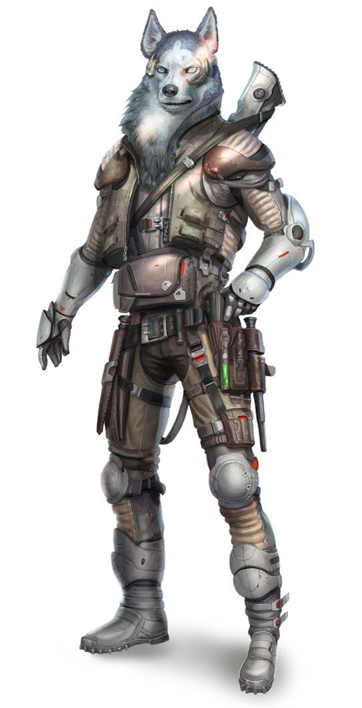

# Влака (Vlaka)

### Физическое описание
Влака - волкоподобные гуманоиды среднего роста (1.6–2м) с густой белой, серой или голубой шерстью, приспособленной к арктическому холоду Лайджока. У них развито обоняние и осязание, а зрение и слух у многих ослаблены или отсутствуют с рождения - примерно две трети Влака глухи, слепы или глухослепы.

!!! note "Возможно, вы..."
    - Определяете настроение собеседника по запаху и движению.
    - Быстро адаптируетесь к новым условиям и находите общий язык с незнакомцами.
    - Принимаете решения, исходя из интересов группы, а не только своих.
    - Готовы помогать, даже если вам за это ничего не дадут.

!!! note "Вероятно, другие..."
    - Доверяют вам в сложных ситуациях и полагаются на вашу честность.
    - Считают, что вы всегда готовы прийти на помощь, иногда даже чересчур.
    - Восхищаются вашей выдержкой, но не всегда понимают ваше упорство.
    - Пытаются воспользоваться вашей добротой.

### Общество и культура
Влака - народ звёздных кочевников, рожденных на холодном Лайджоке (система SN-34) и выживших за счёт взаимопомощи, оптимизма и стремления к знаниям. Их история - пример того, как сплочённость и инновации спасают целый вид от гибели.

Несмотря на то, что Влака малочисленны, они имеют свои кланы и представительство в Звёздном Совете. Их общества строятся вокруг коллектива: уважение, честность, помощь ближнему и взаимное обучение. Каждый Влака принадлежит нескольким "кругам" (семья, друзья, коллеги) и всегда гордится своей принадлежностью.

После длительной оккупации Весками и освобождения вместе с Пахтра, Влака уважают Пахтр как союзников, но отношения остаются настороженными - слишком разные ценности и взгляды на лидерство, хотя оба народа объединяет общий опыт сопротивления. К Вескам Влака относятся настороженно и никогда не забывают о прошлом.

Многие Влака до сих пор живут кочевниками, путешествуя по галактике в караванах. Остальные на разных планетах Звёздного Совета.

Общение у Влака мультисенсорное: они используют не только устную речь, но и жестовый, тактильный язык, запахи, особые метки на предметах и в архитектуре. Тексты часто делают рельефными, чтобы их можно было читать на ощупь.

### Отношение к другим расам
**О Людях:**
"Открыты, быстры на решения, но слишком часто забывают о последствиях для других."

**О Лашунта:**
"Глубоко мыслящие, но временами заносчивы и склонны к поучениям."

**О Йсоках:**
"Искренние, изобретательные, ценят семью - это нас сближает."

**Об Андроидах:**
"Они знают, что значит быть чужим. Мы быстро находим общий язык."

**О Пахтра:**
"Уважение - да. Дружба - не всегда. Слишком разные характеры, но союз был честным."

**О Весках:**
"Те, кто когда-то пытались уничтожить нас. Прошлое не забыто, но мы смотрим вперёд."

**О Ширренах:**
"Идея коллектива понятна нам, но мы не любим терять себя ради других."

**О Скиттермандерах:**
"Их радость жить вдохновляет."

### Имена
Влака выбирают имена с двумя-тремя слогами, часто звучные, иногда с волчьими или снежными мотивами. Полное имя включает не только личное, но и имена кругов, к которым Влака принадлежит (семья, клан, профессиональный круг). В общении с другими расами используют только имя и основной круг.

Примеры имён:
Аеру, Аллаза, Баргай, Джилаво, Калвек, Каплет, Ликос, Мецари, Парва, Ритта, Тарнат, Таррик, Виргар, Йормин.

Примеры кругов:
Серебряные Крылья, Святилище Десяти Деревьев, Дрейфующие, Заснеженный Утёс.

