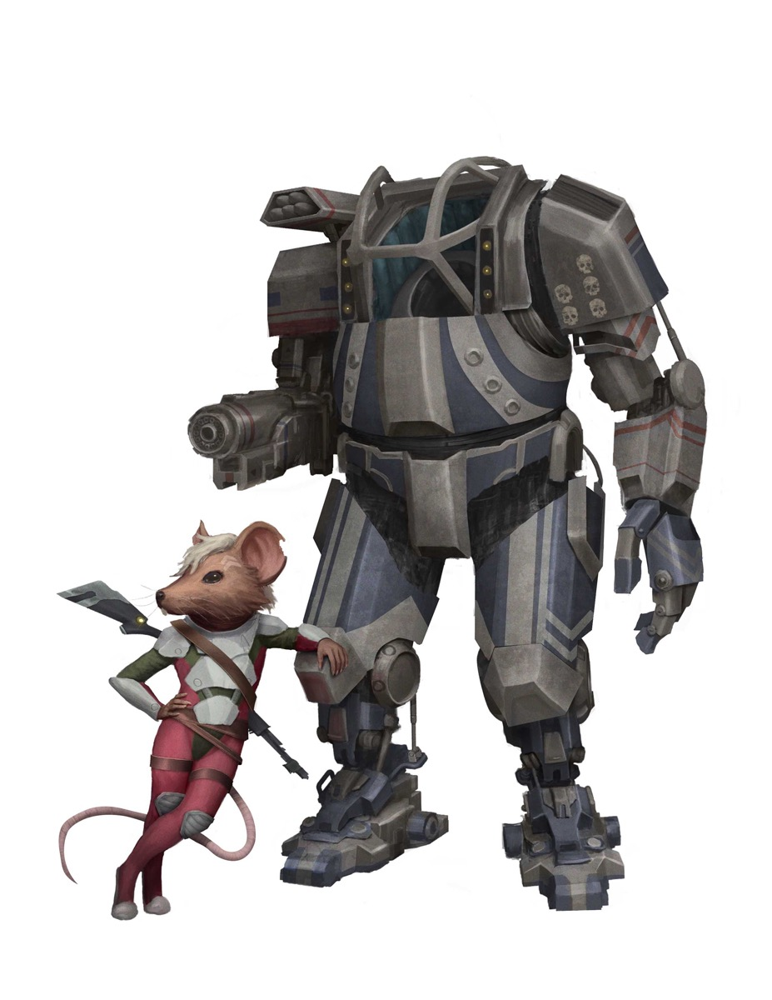

# Йсоки (Ysoki)

!!! note "Возможно, вы..."
    - можете найти решение там, где другие видят только мусор и тупик
    - быстро меняете планы, когда обстоятельства становятся опасными
    - готовы за копейки собрать то, что другим обошлось бы в миллионы
    - считаете, что дружба и выгода вполне совместимы

!!! note "Вероятно, другие..."
    - Думают, что вы слишком прилипчивы и вездесущи, словно крысы
    - Думают, что вы слишком суетливы, слишком разговорчивы, слишком любопытны
    - Думают, что вы работаете ради выгоды, но готовы работать за идею, если идея крутая
    - Думают, что вы готовы выжить где угодно, даже если все остальные уже сдались

### Физическое описание
Йсоки - невысокие, крысоподобные гуманоиды с вытянутыми мордочками, цепкими руками, большими ушами и длинным подвижным хвостом. Их движения быстрые, а реакции молниеносные. Глаза обычно выражают или азарт, или вечную усталость.
Внешний вид варьируется: кто-то ухожен и даже элегантен, кто-то напоминает беглого мусорщика или уличного торговца, кто-то выглядит больше как крыса, а кто-то как мышь.

### Общество и культура
Исторически Йсоки были обществом городских кланов, торговцев и ремесленников, где каждый выживал как умел. Когда люди вышли с ними на контакт, Йсоки первыми поверили в возможность дружбы и обмена знаниями, что на время позволило им стать равными партнёрами Федерации.

После войны с Андроидами Федерация почти без боя захватила миры Йсоков: у них не было ни флота, ни армии, ведь они не ожидали, что их союзник пойдет на них войной. С тех пор Йсоки живут внутри системы, где считаются "ценным ресурсом", но не партнёрами: у них нет политических прав, мало кто слушает их голос, а к карьерному росту часто не допускают.

Несмотря на это, Йсоки не унывают: они создают тайные сообщества поддержки, выживают за счёт изобретательности и хитрости, иногда становясь незаменимыми техническими гениями на станциях, кораблях и в мегаполисах Федерации. Многие "верхние" виды относятся к ним снисходительно, но без Йсоков не работает ни одна станция.

### Отношение к другим расами
**О Людях:** "Люди - сложные партнёры. Они умеют быть дружелюбными, но быстро забывают обещания. Можно делать бизнес, но не доверять важное, если хочешь спать спокойно."

**О Лашунта:** "Вежливы, но слишком любят контролировать процесс. Дружить можно, но осторожно: если им не понравится твоя идея, лучше не спорить"

**Об Андроидах:** "Отличные коллеги: говорят мало, работают много. Понимают, что значит быть на вторых ролях. Иногда слишком серьёзные, но им можно доверять свои схемы и секреты"

**О Пахтра:** "Приятные собеседники и хорошие соседи, если не трогать их реликвии и территорию. С ними можно торговать, играть в игры и даже строить совместные проекты"

**О Весках:** "Опасные, тяжёлые на подъём. Честные, если считать честностью их слова в лицо о том, что тебя могут уволить или оторвать хвост. Лучше не пересекаться, если не хочешь неприятностей"

**О Ширренах:** "Необычные, но добрые. Всегда готовы поделиться чем-то важным, иногда даже тем, о чём не спрашивали. Легко пойти в гости, если не боишься коллективных объятий"

**О Скиттермндерах:** "Лучший рабочий хаос - с ними никогда не бывает скучно. Иногда надоедливые, но всегда веселые, а когда нужно шесть рук или шесть инструментов - первые придут на помощь"

### Имена
Имена Йсоков часто звонкие, короткие, иногда двойные: Мирк, Зиппи, Таск, Фринг, Киллик, Бун, Дуззи, Триск, Фриск, Лесси.
Часто есть клановое или семейное прозвище Таск из Гильдии Погребальных Фонарей, Фриск с Рыночной Площади.

